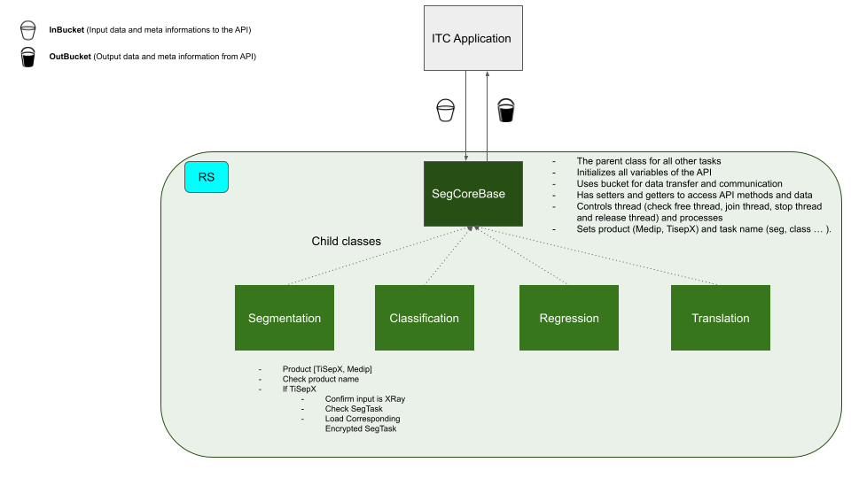

# SegCore C++ API
SeCore is a C++ library for 3D segmentation and analysis of medical images. The API is designed to be simple and easy to integrate into existing Medip software. The aim is to integrate easily segmentation models into Medip Pro. 

# API Overview

## Features
* 3D segmentation of medical images
* 3D analysis of medical images
* Full Preicision (FP32) and Half Precision (FP16) support
* Read and Write to raw file support
* Torchscrip Model support
* Encryption and Decryption of model files
* Multi-GPU support
* Multi-Thread support (comming soon)
* Multi-Model support (comming soon)
* Interactive segmentation (comming soon)
* Model re-training support (comming soon)
* Promptable segmentation (comming soon)
* Text to image segmentation (comming soon)

## TiSepX Model Support (Comming Soon)

## Installation
### Dependencies
* [opencv](https://opencv.org/) >= 3.4
* [openssl](https://www.openssl.org/) >= 1.1.1
* [libtorch](https://pytorch.org/) == 1.7.1
* [dcmtk] (https://dicom.offis.de/dcmtk.php.en) = 3.6.7 

#### Dependency Installation Guide 
* [dcmtk] (https://brandres.medium.com/setup-dcmtk-with-cmake-for-c-and-visual-studio-2019-development-c5b3a40c9a54)

### Build
Download the source code and build the solution file using visaul studio. The solution file is located in the root directory of the project named AI.sln. 

## Author
 
Monib Sediqi @ Resaerch & Science Department, Medical IP Inc. (monib.sediqi@medicalip.com)

Date: 2023-02-01

[Medical IP Inc.](https://www.medicalip.com/)